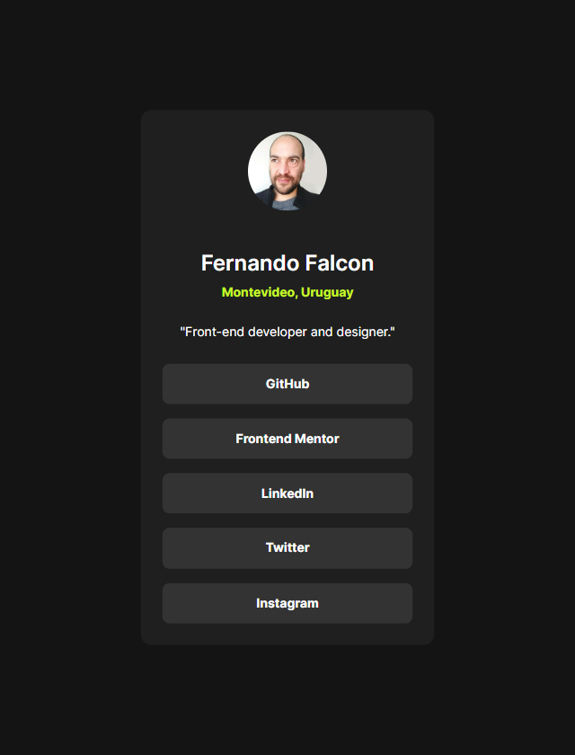

# Frontend Mentor - Social links profile solution

This is a solution to the [Social links profile challenge on Frontend Mentor](https://www.frontendmentor.io/challenges/social-links-profile-UG32l9m6dQ).

## Table of contents

- [Overview](#overview)
  - [The challenge](#the-challenge)
  - [Screenshot](#screenshot)
  - [Links](#links)
- [My process](#my-process)
  - [Built with](#built-with)
- [Author](#author)

## Overview

### The challenge

Users should be able to:

- View the optimal layout depending on their device's screen size
- See hover and focus states for all interactive elements on the page

### Screenshot

### Links

- [Solution URL](https://github.com/ferfalcon/social-links-profile/)
- [Live Site URL](https://ferfalcon.github.io/social-links-profile/)

## Built with

- Semantic HTML5 markup
- CSS custom properties
- CSS Grid
- Less preprocessor [lesscss.org](https://lesscss.org/)
- Mobile-first workflow

## Author

- LinkedIn - [Fernando Falcon](https://www.linkedin.com/in/fernandofalcon/)
- Frontend Mentor - [@ferfalcon](https://www.frontendmentor.io/profile/ferfalcon/)
- Twitter - [@fernandofalcon](https://www.twitter.com/fernandofalcon/)
- Website - [ferfalcon.com](http://ferfalcon.com/)